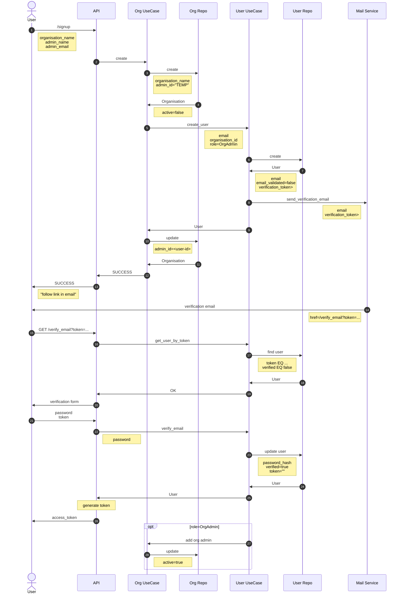

```mermaid
sequenceDiagram
    autonumber

    actor User
    participant API
    participant Org UseCase
    participant Org Repo
    participant User UseCase

    User->>API: /signup
    Note right of User: organisation_name<br>admin_name<br>admin_email

    API->> Org UseCase: create

    Org UseCase->> Org Repo: create
    Note right of Org UseCase: organisation_name<br>admin_id="TEMP"<br>

    Org Repo->> Org UseCase: Organisation
    Note left of Org Repo: active=false

    Org UseCase->> User UseCase: create_user
    Note left of User UseCase: email<br>organisation_id<br>role=OrgAdmin

    User UseCase->> User Repo: create

    User Repo->> User UseCase: User
    Note left of User Repo: email<br>email_validated=false<br>verification_token>

    User UseCase->> Mail Service: send_verification_email
    Note left of Mail Service: email<br>verification_token>

    User UseCase->> Org UseCase: User

    Org UseCase->> Org Repo: update
    Note right of Org UseCase: admin_id=<user-id>

    Org Repo ->> Org UseCase: Organisation

    Org UseCase->> API: SUCCESS

    API->> User: SUCCESS
    Note right of User: "follow link in email"

    Mail Service->> User: verification email
    Note left of Mail Service: href=/verify_email?token=...

    User->> API: GET /verify_email?token=...

    API->> User UseCase: get_user_by_token
    User UseCase->> User Repo: find user
    Note left of User Repo: token EQ ...<br>verified EQ false

    User Repo ->> User UseCase: User
    User UseCase ->> API: OK

    API->> User: verification form
    User->> API: password<br>token

    API->> User UseCase: verify_email
    Note right of API: password

    User UseCase->> User Repo: update user
    note left of User Repo: password_hash<br>verified=true<br>token=""

    User Repo->> User UseCase: User

    User UseCase ->> API: User

    Note over API: generate token

    API ->> User: access_token

    opt role=OrgAdmin
        User UseCase->> Org UseCase: add org admin

        Org UseCase->> Org Repo: update
        note left of Org Repo: active=true
    end


```
